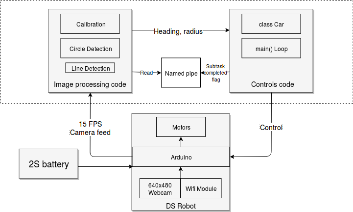

# **DSRobotContoller**

We worked with a Arduino DSRobot dubbed Freddie – a rudimentary 4-wheeled robotic car with a simple on-board webcam, produced by Kuman. The robot is capable of accepting controls over WiFi: go forward, stop turn, pan/tilt the camera and set motor speed. Further, the robot can provide the live feed from the camera, also through WiFi. As a part of Embedded Systems Spring 2018 class at New York University Abu Dhabi, we address 3 challenges: 1) Go-to goal, 2) Follow-a-leader and 3) Trajectory following. The demo videos can be found [here](https://drive.google.com/open?id=1bi-pUCUekyuy8N5dO6uPZAHpTDI1L-ii)

The system works on an out-of-the-box robot and does not require an external localizer/camera. The controls code is written in C++ and image processing is done in Python, relying on OpenCV 3. It is robust to different lighting conditions and can be calibrated for any color tracking. 

## **Solution Overview**
As can be seen in the fig below, the system has two main modules: image processing and controls. The calibration module enables an easy color range determination for an encoding in a particular color space (RGB, HSV and LAB). The on-board camera feeds 15 FPS into the system. In one second, we determined that we our image processing can keep up with the feed. However, piping, executing controls code and communicating back to the robot result in an actual processing rate of 12 FPS. This is why, in the image processing code, we purposefully drop every 5th frame. The image processing feeds position and radius of the ball in the frame to the controls code. The control code sends out necessary commands to the robot in order to perform the specific tasks. Some features provided by the controls code include slowing down of the robot as it gets closer to the ball, remembrance of the direction in the which the ball disappeared (so as to turn in the same direction to seek the ball) and on the go direction adjustment for the moving target.

****

**Usage:**

Install Python 3, OpenCV 3 and imutils package to run the image processing code. 

```bash
$ git clone git@github.com:sherl0ck-/DSRobotContoller.git
$ cd DSRobotController/c++
$ mkdir bin; make
$ python ../balltracking.py -p PROBLEM | bin/main 192.168.1.1 2001 [trajectory] 
# PROBLEM must be atob or trajectory
	# atob follows the ball to a point or a leader when the ball is put on it
	# trajectory follows a trajectory
```

